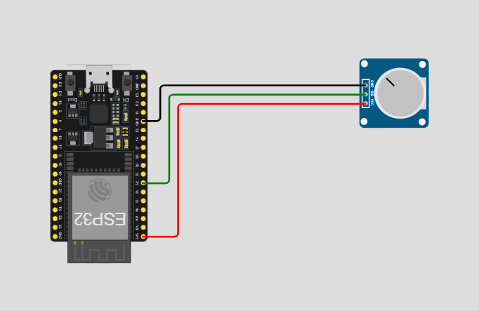
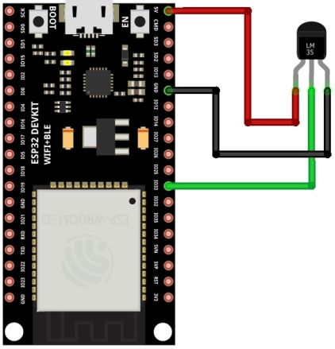
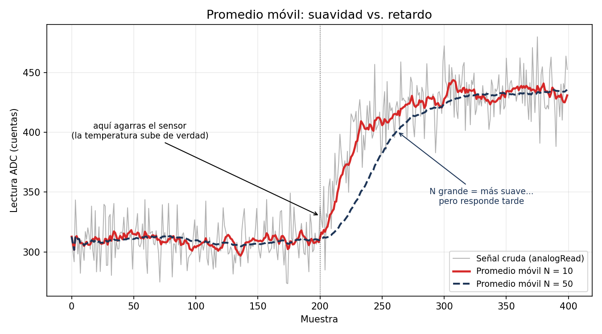
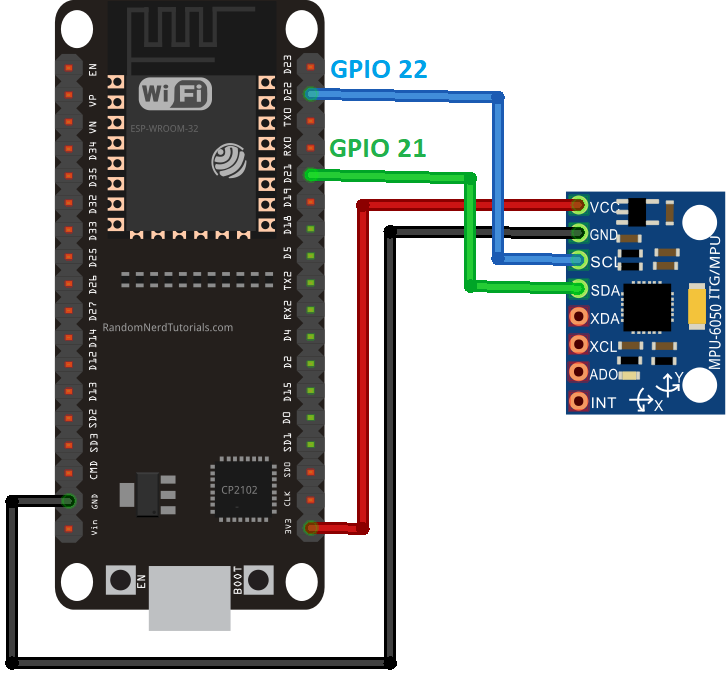

# Sensores 101

> Objetivo: Leer sensores analógicos y digitales con el ESP32, **calibrarlos contra una referencia**, filtrar el ruido con un promedio móvil y documentar curvas de calibración — la base de cualquier sistema de instrumentación.

**Materiales**

- ESP32 DevKit V1 + protoboard y jumpers.
- **Potenciómetro** de 10 kΩ.
- **LM35** (sensor de temperatura analógico).
- **Acelerómetro** MPU6050 (módulo I2C). *(Si tu módulo es analógico tipo ADXL335, ve la nota al final.)*
- Termómetro de referencia (el de la app del clima **no** cuenta; uno ambiental o infrarrojo del laboratorio).

---

## 1. La cadena de medición

Todo sensor sigue la misma cadena:


El trabajo de instrumentación es **cada flecha**: entender qué hace el sensor, qué hace el ADC y qué cálculo convierte el número crudo en °C, grados o m/s².

---

## 2. El ADC del ESP32

- **Resolución:** 12 bits → valores de **0 a 4095**.
- **Rango:** 0 a **3.3 V** (con la atenuación por defecto).
- **Conversión a voltaje:**

\[
V = \frac{lectura}{4095} \times 3.3
\]

!!! warning "Qué pines usar"
    Usa los pines de **ADC1**: GPIO **32, 33, 34, 35, 36, 39**. Los de ADC2 dejan de funcionar cuando el radio (WiFi/Bluetooth) está activo — y nuestro carro usa Bluetooth, así que ADC2 está prohibido en este curso. Recuerda además que **34, 35, 36 y 39 son solo entrada**.

!!! info "El ADC del ESP32 no es perfecto"
    Cerca de 0 V y cerca de 3.3 V la respuesta se **aplana** (no es lineal en los extremos). Por eso calibramos contra una referencia en lugar de confiar ciegamente en la fórmula. Verlo en tus propias curvas es parte de la práctica.

---

## 3. Potenciómetro: tu primera "perilla"

Un potenciómetro es un **resistor variable**: al girar la perilla mueves un contacto sobre una pista resistiva y formas un **divisor de voltaje**.

\[
V_{out} = V_{cc} \cdot \frac{R_{abajo}}{R_{total}}
\]

**Conexión:** extremo 1 a 3.3 V, extremo 2 a GND, pin central (wiper) al **GPIO 34**.

{loading=lazy width="60%"}

```cpp title="Lectura y escalado del potenciómetro"
const int pinPot = 34;   // ADC1, solo entrada

void setup() {
  Serial.begin(115200);
}

void loop() {
  int crudo = analogRead(pinPot);                  // 0 - 4095
  float volt = crudo * (3.3 / 4095.0);             // a voltaje

  // Escalado a un rango útil, dos formas:
  int porcentaje = map(crudo, 0, 4095, 0, 100);    // enteros
  float angulo = crudo * (270.0 / 4095.0);         // float (giro típico de un pot: 270°)

  Serial.print("crudo: ");      Serial.print(crudo);
  Serial.print("  volt: ");     Serial.print(volt, 3);
  Serial.print("  %: ");        Serial.print(porcentaje);
  Serial.print("  angulo: ");   Serial.println(angulo, 1);
  delay(100);
}
```

!!! tip "Conexión con el proyecto"
    Este mismo escalado (`map` de un rango a otro) es el que usarás para convertir comandos de velocidad en PWM del carro. Y en el torneo, un potenciómetro puede ser tu "perilla de velocidad máxima" para pruebas.

---

## 4. LM35: temperatura con calibración

El LM35 entrega **10 mV por cada °C**: a 25 °C su salida es 0.25 V. La conversión teórica es directa:

\[
T~[°C] = V_{out} \times 100
\]

!!! warning "El LM35 se alimenta con 5 V, no con 3.3 V"
    El LM35 requiere mínimo **4 V** de alimentación (hoja de datos: 4–30 V). Aliméntalo desde el pin **VIN/5V** del DevKit. Su **salida es segura** para el ADC: a temperaturas normales nunca pasa de ~0.5 V (50 °C), muy por debajo de los 3.3 V del ESP32.

**Conexión:** viendo el lado plano del TO-92 de frente: izquierda = **+5 V (VIN)**, centro = **salida → GPIO 35**, derecha = **GND**. Si lo conectas al revés se calienta de inmediato — desconecta y revisa.

{loading=lazy width="60%"}

```cpp title="Lectura de temperatura (conversión teórica)"
const int pinLM35 = 35;

void setup() {
  Serial.begin(115200);
}

void loop() {
  int crudo = analogRead(pinLM35);
  float volt = crudo * (3.3 / 4095.0);
  float tempC = volt * 100.0;            // 10 mV/°C

  Serial.print("ADC: ");   Serial.print(crudo);
  Serial.print("  V: ");   Serial.print(volt, 3);
  Serial.print("  T: ");   Serial.print(tempC, 1);
  Serial.println(" C");
  delay(500);
}
```

### 4.1 Tabla de calibración (el entregable)

La fórmula teórica supone un ADC perfecto — que ya sabemos que no lo es. Vamos a **calibrar contra una referencia**:

1. Toma al menos **5 puntos** a distintas temperaturas: ambiente, sensor entre los dedos, cerca de una lámpara, junto a algo frío (lata fría; **sin mojar el sensor**), etc.
2. En cada punto, espera a que la lectura se **estabilice** y registra tres columnas:

| Punto | T referencia (°C) | Lectura ADC | T calculada (°C) | Error (°C) |
| --- | --- | --- | --- | --- |
| Ambiente | | | | |
| Entre dedos | | | | |
| Lámpara | | | | |
| Lata fría | | | | |
| Otro | | | | |

3. Grafica **T referencia vs. lectura ADC** (en Excel, Sheets o Python). Esa es tu **curva de calibración**.
4. **Linealización básica:** ajusta una recta \( T = m \cdot ADC + b \) a tus puntos (línea de tendencia en la hoja de cálculo). Sustituye la fórmula teórica por **tu** recta en el código y verifica que el error baja.

!!! question "Para tu bitácora"
    ¿Tu recta calibrada tiene la pendiente que predice la teoría? ¿Dónde se desvía más: en frío o en caliente? ¿Qué dice eso del ADC del ESP32?

---

## 5. Ruido y promedio móvil

Deja el LM35 quieto y observa el monitor serial: la lectura **baila** aunque la temperatura no cambie. Eso es **ruido**. El filtro más simple y usado: promediar las últimas N muestras.

{loading=lazy width="70%"}

```cpp title="Promedio móvil de N muestras (buffer circular)"
const int pinSensor = 35;
const int N = 10;              // tamaño de la ventana

int buffer_[N];
int indice = 0;
long suma = 0;
bool lleno = false;

float promedioMovil(int nuevaLectura) {
  suma -= buffer_[indice];       // saca la muestra más vieja
  buffer_[indice] = nuevaLectura;
  suma += nuevaLectura;          // mete la nueva
  indice = (indice + 1) % N;
  if (indice == 0) lleno = true;
  return suma / float(lleno ? N : indice);
}

void setup() {
  Serial.begin(115200);
  for (int i = 0; i < N; i++) buffer_[i] = 0;
}

void loop() {
  int crudo = analogRead(pinSensor);
  float filtrado = promedioMovil(crudo);

  // Imprime ambos para graficarlos juntos en el Serial Plotter
  Serial.print(crudo);
  Serial.print(" ");
  Serial.println(filtrado);
  delay(50);
}
```

!!! tip "Míralo con el Serial Plotter"
    En Arduino IDE: **Herramientas → Serial Plotter**. Verás dos líneas: la cruda (nerviosa) y la filtrada (suave). Una captura de esa gráfica es evidencia perfecta para tu portafolio.

**El precio del filtro:** entre más grande la ventana N, más suave la señal… pero más **lento** responde a cambios reales. Prueba N = 3, 10 y 50 y anota la diferencia. Este compromiso suavidad-vs-retardo te lo vas a volver a encontrar en el PID (la derivada odia el ruido) y en visión.

---

## 6. Acelerómetro MPU6050: inclinación e impactos

El MPU6050 mide **aceleración en 3 ejes** (y giro, que hoy no usaremos). No es analógico: se comunica por **I2C**, un bus digital de dos cables.

**Conexión (I2C):**

| MPU6050 | ESP32 |
| --- | --- |
| VCC | 3.3 V |
| GND | GND |
| SDA | GPIO 21 |
| SCL | GPIO 22 |

{loading=lazy width="60%"}

Instala la librería **Adafruit MPU6050** (Gestor de librerías; instala también sus dependencias cuando lo pida).

```cpp title="Inclinación e impacto con MPU6050"
#include <Adafruit_MPU6050.h>
#include <Adafruit_Sensor.h>
#include <Wire.h>
#include <math.h>

Adafruit_MPU6050 mpu;

void setup() {
  Serial.begin(115200);
  if (!mpu.begin()) {
    Serial.println("No se encontro el MPU6050 (revisa SDA/SCL y alimentacion)");
    while (true) delay(100);
  }
  mpu.setAccelerometerRange(MPU6050_RANGE_8_G);
}

void loop() {
  sensors_event_t a, g, temp;
  mpu.getEvent(&a, &g, &temp);

  float ax = a.acceleration.x;
  float ay = a.acceleration.y;
  float az = a.acceleration.z;

  // Inclinación (roll y pitch) a partir de la gravedad
  float roll  = atan2(ay, az) * 180.0 / PI;
  float pitch = atan2(-ax, sqrt(ay * ay + az * az)) * 180.0 / PI;

  // Magnitud total: en reposo ~9.81 (la gravedad). Un pico = golpe.
  float magnitud = sqrt(ax * ax + ay * ay + az * az);
  bool impacto = fabs(magnitud - 9.81) > 15.0;   // umbral en m/s^2, ajústalo

  Serial.print("roll: ");     Serial.print(roll, 1);
  Serial.print("  pitch: ");  Serial.print(pitch, 1);
  Serial.print("  |a|: ");    Serial.print(magnitud, 2);
  if (impacto) Serial.print("  *** IMPACTO ***");
  Serial.println();
  delay(100);
}
```

**Experimentos:**

1. Inclina la protoboard y verifica que roll/pitch corresponden (usa el nivel del celular como referencia — ¡otra calibración!).
2. Dale un golpecito a la mesa y observa el pico de magnitud. Ajusta el umbral hasta que detecte golpes reales sin falsas alarmas.
3. Aplica el **promedio móvil** de la sección 5 a roll/pitch y compara.

!!! tip "Conexión con el proyecto"
    Montado en el carro, el MPU6050 detecta **choques** (¿faul en el torneo?) e inclinación (¿el carro está volcado?). Guárdalo en tu caja de herramientas para el proyecto final.

!!! note "¿Tu acelerómetro es analógico (ADXL335)?"
    Entonces no usa I2C: entrega tres voltajes (X, Y, Z) que se leen con `analogRead` en tres pines de ADC1, igual que el potenciómetro. Sensibilidad típica: ~300 mV/g centrado en Vcc/2. La inclinación se calcula con el mismo `atan2` de arriba, usando los valores en g.

---

## 7. Entregables de la sesión (van al portafolio)

1. **Curvas de calibración** del potenciómetro (ADC vs. ángulo/posición) y del LM35 (T referencia vs. ADC), con su recta ajustada.
2. **Tablas de datos** completas con errores.
3. **Captura del Serial Plotter** mostrando señal cruda vs. filtrada, con tu elección de N justificada.
4. **Código comentado** en el repositorio, con README breve de conexiones.
5. **Bitácora**: qué falló, qué te sorprendió (¿el ADC es tan lineal como prometía?).

---

### Glosario rápido
- **ADC:** convertidor analógico-digital; voltaje → número.
- **Resolución:** cuántos pasos distingue el ADC (12 bits = 4096 pasos).
- **Calibración:** comparar contra una referencia confiable y corregir.
- **Linealización:** sustituir la fórmula teórica por una recta ajustada a tus datos.
- **Promedio móvil:** filtro que promedia las últimas N muestras.
- **I2C:** bus digital de 2 cables (SDA/SCL) para sensores "inteligentes".
