# Mecanismos 101

> Objetivo: Entender cómo los mecanismos **transforman el movimiento** (velocidad ↔ par, rotación ↔ traslación, continuo ↔ intermitente), calcular relaciones de transmisión simples y aplicarlo al tren motriz del carro — tocando mecanismos reales en un taller de estaciones.

---

## 1. ¿Por qué mecanismos?

Un motor DC "pelón" gira **muy rápido y con muy poco par**: no puede mover casi nada directamente. Los mecanismos son el intercambio de moneda de la mecánica:

> **Sacrificas velocidad para ganar fuerza (o al revés), o cambias el tipo de movimiento.**

Tu carro es el ejemplo perfecto: los motores amarillos "TT" que usamos traen una **caja reductora interna de ~1:48** — el motorcito de adentro gira ~9600 rpm y la rueda sale a ~200 rpm, pero con 48 veces más par. Sin esa caja, el carro no se movería.

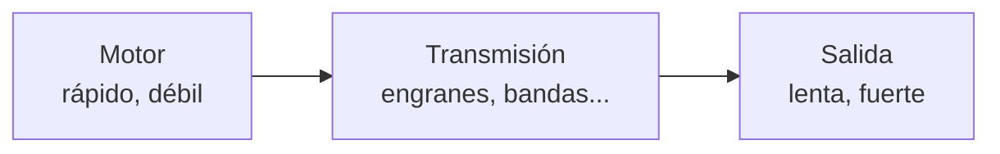

---

## 2. Conceptos base

### 2.1 Palancas (la máquina más antigua)

\[
F_1 \cdot d_1 = F_2 \cdot d_2
\]

La **ventaja mecánica** es la relación de brazos: brazo largo del lado de tu esfuerzo = menos fuerza necesaria (pero más recorrido). Las tres clases se distinguen por dónde está el punto de apoyo (fulcro) respecto a la carga y el esfuerzo — tijeras, carretilla y pinzas son una de cada clase.

### 2.2 Biela-manivela

Convierte **rotación ↔ traslación**: es el corazón del motor de combustión (pistón → cigüeñal) y de mecanismos de vaivén. Obsérvalo: la velocidad del extremo **no es constante** aunque la manivela gire parejo — se detiene por completo en los extremos del recorrido.

### 2.3 Relación de transmisión (la fórmula del día)

Para dos engranes acoplados con \( Z_1 \) dientes (entrada) y \( Z_2 \) dientes (salida):

\[
i = \frac{Z_2}{Z_1} = \frac{\omega_{entrada}}{\omega_{salida}} = \frac{\tau_{salida}}{\tau_{entrada}}
\]

- \( i > 1 \): **reducción** → sale más lento pero con más par.
- \( i < 1 \): **multiplicación** → sale más rápido pero con menos par.
- El par y la velocidad se intercambian: \( \omega_2 = \omega_1 / i \) y \( \tau_2 = \tau_1 \cdot i \) (menos las pérdidas por fricción).

**Trenes compuestos:** las relaciones se **multiplican**. Dos etapas de 1:4 dan 1:16. Así la caja del motor TT logra 1:48 en un espacio diminuto.

**Ejemplo resuelto:** piñón de 12 dientes mueve engrane de 36:

\[
i = \frac{36}{12} = 3 \quad\Rightarrow\quad \text{la salida gira a } \tfrac{1}{3} \text{ de la velocidad, con } 3\times \text{ el par}
\]

---

## 3. Taller de estaciones (los modelos impresos)

En el laboratorio hay **mecanismos impresos en 3D, funcionales**. Van a rotar en equipos por las estaciones. En cada una: **muévelo con la mano**, observa, y llena la ficha de la sección 4.

!!! info "Regla del taller"
    Gíralos con suavidad — son PLA, no acero. Si algo se traba, no lo fuerces: observar **por qué** se traba también es aprender mecanismos.

### Estación A · Diferencial

[Modelo](https://www.printables.com/model/1457586-educational-model-of-differential-gear)

{loading=lazy width="50%"}

En una curva, la rueda exterior recorre **más distancia** que la interior: si ambas giraran igual, una tendría que patinar. El diferencial reparte el giro permitiendo velocidades distintas con un solo motor.

**Pruébalo:** detén una salida con el dedo mientras giras la entrada — ¿qué hace la otra rueda?

**Conexión con tu carro:** tu carro NO trae este mecanismo… porque tiene **un motor por rueda**: el "diferencial" lo hace el software al mandar `M,izq,der` con velocidades distintas. Se llama **dirección diferencial** (y este modelo te muestra el problema que resuelve).

### Estación B · Reductor cicloidal

[Modelo](https://www.printables.com/model/1453110-educational-model-of-cycloidal-drive)

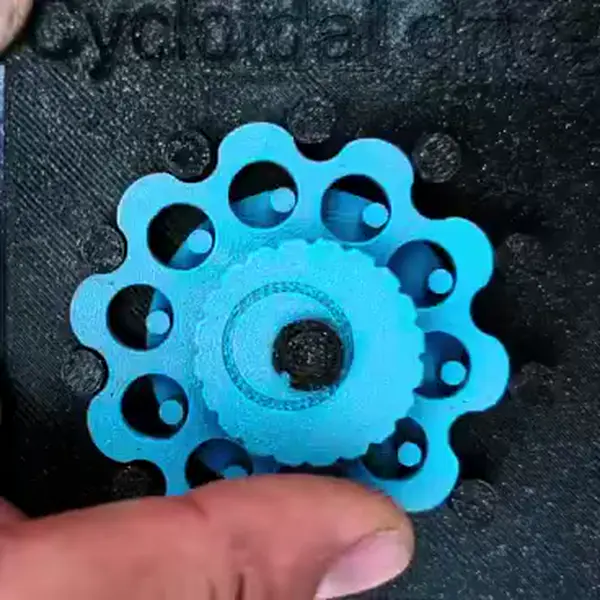{loading=lazy width="50%"}

Reducción **enorme en muy poco espacio**, con poco juego (backlash). Es el mecanismo favorito de las **articulaciones de robots industriales**.

**Pruébalo:** cuenta cuántas vueltas de entrada necesitas para una vuelta de salida — esa es su relación \( i \). ¿Va en el mismo sentido la salida que la entrada?

### Estación C · Junta cardán (universal)

[Modelo](https://www.printables.com/model/1458401-educational-model-of-cardan-universal-joint)

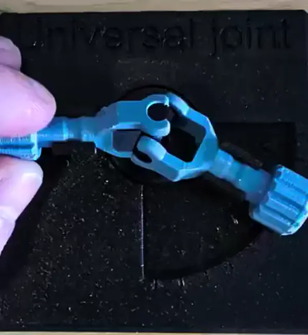{loading=lazy width="50%"}

Transmite rotación entre **ejes que forman un ángulo** (la flecha de transmisión de camionetas).

**Pruébalo:** gira la entrada a velocidad constante con el eje doblado y fíjate en la salida — **no gira pareja**: acelera y desacelera dos veces por vuelta. Entre más ángulo, peor. (Por eso las flechas reales usan cardán doble.)

### Estación D · Obturador de láminas (leaf shutter)

[Modelo](https://www.printables.com/model/1453149-educational-model-of-leaf-shutter)

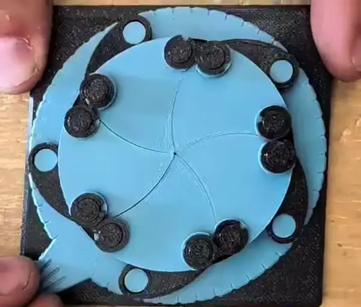{loading=lazy width="50%"}

Varias láminas **sincronizadas por un solo anillo**: un movimiento de entrada, muchas salidas coordinadas. Es el mecanismo del diafragma/obturador de las cámaras fotográficas.

**Conexión con visión:** el obturador controla el **tiempo de exposición**. ¿Recuerdas el *motion blur* que hace perder los marcadores ArUco cuando el carro va rápido? Es exactamente esto: exposición larga = imagen movida. La mecánica y la visión por computadora se tocan aquí.

### Estación E1 · Transformar el movimiento

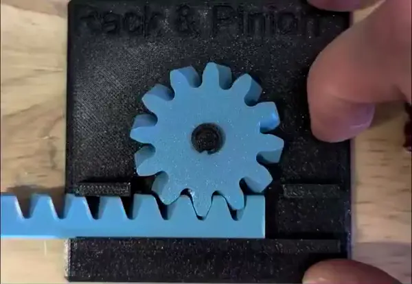{loading=lazy}

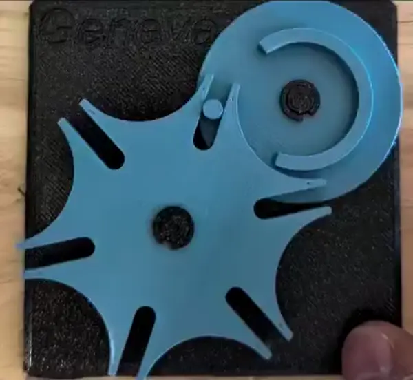{loading=lazy}

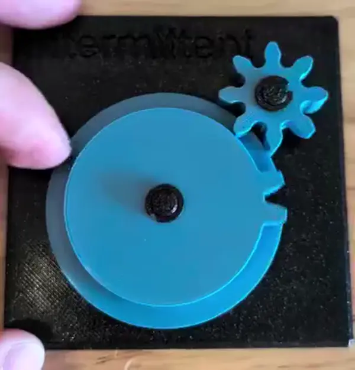{loading=lazy}

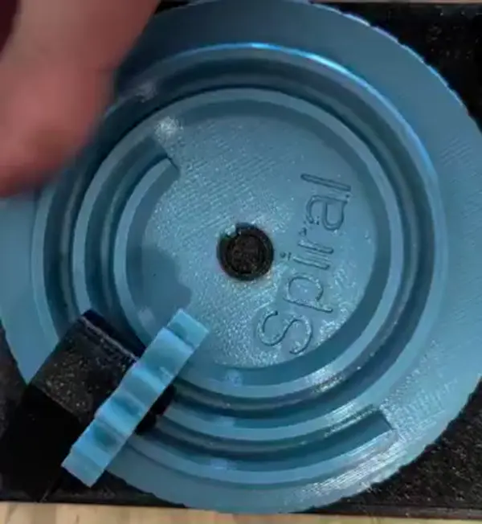{loading=lazy}

La pregunta central de esta estación: **¿qué tipo de movimiento entra y cuál sale?**

| Mecanismo | Qué hace | Dónde vive |
| --- | --- | --- |
| **Cremallera y piñón helicoidal** | Rotación → **traslación** | Dirección de los autos, ejes de impresoras 3D |
| **Cruz de Ginebra** | Rotación continua → **intermitente** (avanza por pasos y se bloquea entre ellos) | Proyectores de cine, indexadores, relojería |
| **Engrane intermitente** | Transmite solo en **parte del giro** (sin bloqueo entre pasos) | Contadores mecánicos, temporizadores |
| **Espiral de Arquímedes** | Relación de transmisión **variable** durante la vuelta | Levas, mecanismos de retorno rápido |

**Pruébalos en pareja:** gira la Ginebra y el intermitente uno junto al otro a la misma velocidad — los dos producen movimiento "a ratos", pero uno **se bloquea** entre pasos y el otro queda **libre**. ¿En qué aplicación importaría esa diferencia?

**Pregunta obligada (Ginebra):** si la cruz tiene \( n \) ranuras, ¿cuántas vueltas del impulsor necesita para dar una vuelta completa? ¿Cuántos grados avanza por "paso"?

### Estación E2 · Redirigir y reducir

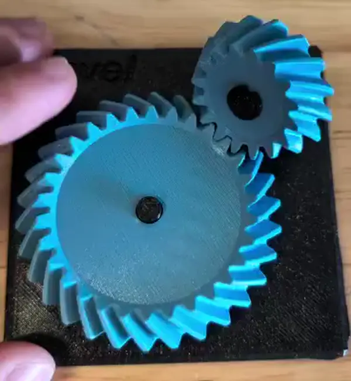{loading=lazy}

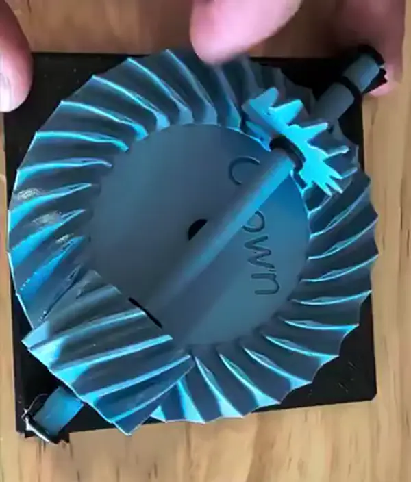{loading=lazy}

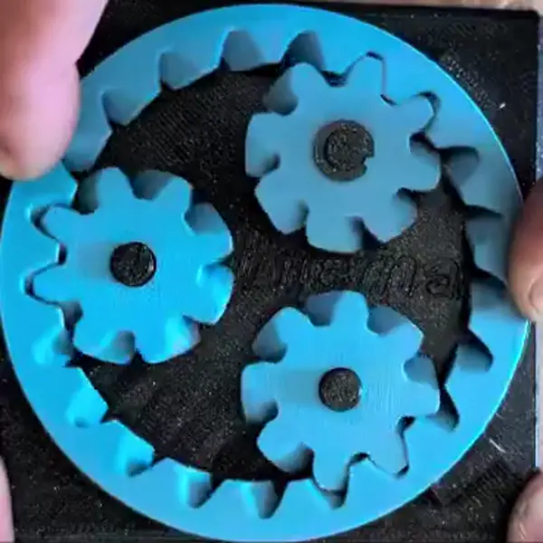{loading=lazy}

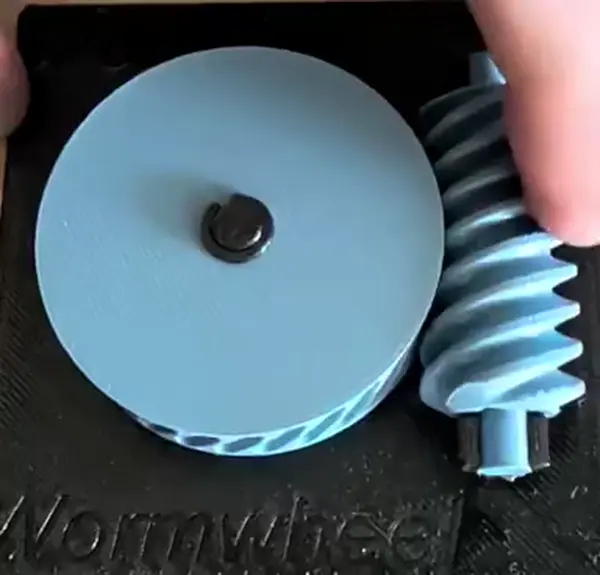{loading=lazy}

La pregunta central de esta estación: **¿cuánto reduce, hacia dónde saca el giro, y se puede mover al revés?**

| Mecanismo | Qué hace | Dónde vive |
| --- | --- | --- |
| **Cónico espiral** | Cambia el eje de giro **90°** | Diferenciales, taladros angulares |
| **Corona (crown gear)** | 90° con engrane plano | Batidoras, juguetes |
| **Engrane interno helicoidal** | Reducción compacta, ejes al mismo lado y **mismo sentido** de giro | Trenes planetarios, cajas de bicicleta |
| **Sinfín multi-hilo + corona** | Reducción **grande en una sola etapa** | Reductores de portones, afinadores de guitarra |

**Pruébalos comparando:** cuenta dientes y estima la relación \( i \) de cada uno — en esta mesa hay desde relaciones cercanas a 1:1 hasta la más grande de todo el taller. ¿Cuál da más reducción por centímetro cúbico?

**Pregunta obligada (sinfín):** intenta mover la corona empujándola directamente (con el sinfín acoplado). ¿Se deja? Esa propiedad se llama **autobloqueo** — el sinfín puede mover a la corona, pero la corona no puede mover al sinfín. ¿Para qué sirve eso en un robot? (Pista: sostener una carga sin gastar energía.)

---

## 4. Ficha de estación (llénala en cada una)

Copia esta tabla en tu bitácora, una fila por estación:

| Estación | ¿Qué transforma? (vel↔par, rot↔trasl, continuo↔intermitente, cambio de eje) | Relación \( i \) estimada (cuenta dientes o vueltas) | ¿Reversible o autobloqueante? | ¿Dónde lo has visto en la vida real? | ¿Dónde serviría en el carro o en un proyecto tuyo? |
| --- | --- | --- | --- | --- | --- |
| A · Diferencial | | | | | |
| B · Cicloidal | | | | | |
| C · Cardán | | | | | |
| D · Obturador | | | | | |
| E1 · (elige 2 de la mesa) | | | | | |
| E2 · (elige 2 de la mesa) | | | | | |

---

## 5. Hoja de ejercicios (el entregable)

Resuelve con procedimiento (no solo el resultado):

**1. Tren simple.** Un piñón de 10 dientes mueve un engrane de 40. Si el motor entrega 300 rpm y 0.1 N·m, ¿a qué velocidad y con qué par gira la salida? (Ignora pérdidas.)

**2. Tren compuesto.** Dos etapas: 12→36 dientes y luego 10→40 dientes. ¿Relación total? Si la entrada gira a 960 rpm, ¿la salida?

**3. Sinfín.** Un sinfín de **2 hilos** mueve una corona de 40 dientes. ¿Relación de transmisión? (Pista: en un sinfín, \( Z_1 \) = número de hilos.) ¿Cuántas vueltas del sinfín para una de la corona?

**4. Cruz de Ginebra.** La del laboratorio tiene sus ranuras a la vista: cuéntalas y calcula grados por paso y vueltas del impulsor por vuelta completa de la cruz.

**5. Tu carro (velocidad).** El motor TT tiene reducción interna 1:48 y a 6 V la rueda gira ~200 rpm sin carga. Con ruedas de **65 mm** de diámetro:

\[
v = \pi \cdot D \cdot \frac{rpm}{60}
\]

¿Cuál es la velocidad máxima teórica del carro en m/s? ¿Por qué en el piso real será menor?

**6. Tu carro (dirección diferencial).** Si la rueda izquierda va a 0.4 m/s, la derecha a 0.6 m/s y la separación entre ruedas es \( L = 0.12 \) m:

\[
v = \frac{v_{der} + v_{izq}}{2} \qquad \omega = \frac{v_{der} - v_{izq}}{L} \qquad R = \frac{v}{\omega}
\]

Calcula la velocidad del centro, la velocidad de giro y el radio de la curva que describe. **Fíjate**: estas son exactamente las ecuaciones detrás del `izq = v - w, der = v + w` que usa el script de visión del Tema 6 — la mezcla diferencial no era un truco de software, era cinemática.

**7. Diseño.** Quieres que tu carro sea el doble de "fuerte" para empujar la pelota en el torneo, aceptando ir a la mitad de velocidad. Propón una relación de engranes adicional entre motor y rueda y calcula la nueva velocidad máxima.

---

## 6. Mini-prototipo (para quien quiera ir más allá)

Con cartón, palitos y silicón — o en la impresora 3D de Proyectos 1 — construye **un** mecanismo de los que viste y móntalo en video funcionando. Ideas: una palanca con ventaja mecánica medible, una biela-manivela, un tren de dos engranes de cartón con relación 1:2 verificable contando vueltas.

---

## 7. Entregables de la sesión (van al portafolio)

1. **Ficha de estaciones** completa (sección 4), con fotos tuyas de los mecanismos.
2. **Hoja de ejercicios** resuelta con procedimiento (sección 5).
3. (Opcional, cuenta como extra) **Mini-prototipo** con video corto funcionando.

---

### Glosario rápido
- **Relación de transmisión (i):** cociente de velocidades entrada/salida; intercambia velocidad por par.
- **Reducción:** salida más lenta y con más par que la entrada.
- **Backlash (juego):** holgura entre dientes; se siente como "flojera" al invertir el giro.
- **Autobloqueo:** el mecanismo transmite en un sentido pero no puede ser movido desde la salida (sinfín).
- **Movimiento intermitente:** avance por pasos con bloqueo entre ellos (cruz de Ginebra).
- **Dirección diferencial:** girar mediante velocidades distintas en cada rueda, sin ruedas direccionales.
