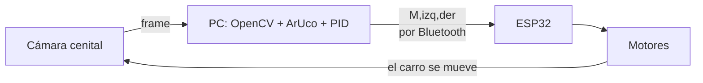

# Visión por Computadora 102 · Cierre de lazo

En el tema anterior la cámara **veía**; ahora la cámara va a **controlar**. La idea es cerrar el lazo completo:

> La cámara cenital mide **dónde está el carro** y **dónde debe estar** → la PC calcula el **error** → un **PID** convierte el error en velocidades → las velocidades viajan por **Bluetooth** al ESP32 → el carro se mueve → la cámara vuelve a medir.

Este es exactamente el esquema de la categoría **IEEE Very Small Size Soccer (VSSS)**: toda la inteligencia vive en la PC, el robot solo obedece velocidades.



**Requisitos previos**

- Imágenes, frames y dibujo con OpenCV (Tema 4).
- Protocolo de comandos por Bluetooth (Tema 2).
- Control de motores con puente H y PWM (Tema 3).
- Conceptos P–I–D (Tema 5).

**Materiales**

- Carro del Proyecto 1 (ESP32 + driver **TB6612** + 2 motores DC).
- Cámara **cenital**: la webcam de la laptop apuntando la cancha desde arriba (apóyala en una repisa o pila de libros), o mejor: el **celular como webcam** (DroidCam en Android, Continuity Camera en Mac) montado en un tripié — es más fácil de colgar sobre la cancha y suele tener mejor imagen.
- **2 marcadores ArUco impresos**: uno para el carro y uno para el objetivo (abajo los generamos).
- PC con Python 3 y:

```bash
pip install opencv-python numpy pyserial
```

!!! note "Versión de OpenCV"
    El módulo ArUco viene incluido en `opencv-python` desde la versión **4.7**. Si tienes una versión anterior, instala `opencv-contrib-python` o actualiza: `pip install -U opencv-python`.

!!! warning "Antes de empezar"
    - Fija la cámara: si se mueve, tu geometría se pierde.
    - Iluminación pareja y sin reflejos; imprime los marcadores en papel **mate**.
    - Marcadores de **al menos 5 cm por lado** para una cámara a 1.5–2 m con 640×480, y **con su borde blanco** alrededor (sin ese margen, ArUco no los detecta).

---

## 1. ¿Por qué marcadores ArUco?

Un marcador ArUco es un "QR simplificado": un patrón cuadrado en blanco y negro que OpenCV detecta y decodifica. De **un solo marcador** obtienes tres cosas que con parches de color costarían mucho trabajo:

1. **Identidad**: cada marcador tiene un **ID único**. En el torneo, cada carro lleva su ID y la PC nunca los confunde — sin pelearse con paletas de colores.
2. **Posición**: las 4 esquinas del marcador, con precisión de sub-píxel. El centro es la posición del carro.
3. **Orientación**: las esquinas vienen **ordenadas** (el detector sabe cuál es la esquina superior-izquierda del patrón), así que un solo marcador te dice hacia dónde apunta el carro.

Además es robusto ante cambios de iluminación — adiós al "recalibra el HSV porque hoy está nublado". Su punto débil: el **desenfoque por movimiento** (motion blur) puede perder la detección cuando el carro va muy rápido; se mitiga con buena luz y marcadores grandes.

### 1.1 Generar e imprimir los marcadores

```python title="generar_marcadores.py"
import cv2

diccionario = cv2.aruco.getPredefinedDictionary(cv2.aruco.DICT_4X4_50)

for id_marcador in [0, 1]:            # 0 = objetivo, 1 = carro
    img = cv2.aruco.generateImageMarker(diccionario, id_marcador, 400)
    # Borde blanco (quiet zone): obligatorio para que se detecte
    img = cv2.copyMakeBorder(img, 50, 50, 50, 50,
                             cv2.BORDER_CONSTANT, value=255)
    cv2.imwrite(f"marcador_{id_marcador}.png", img)
    print(f"marcador_{id_marcador}.png generado")
```

Imprime cada uno a **5 cm o más por lado** (sin contar el borde blanco) y pégalos en cartón rígido para que queden **planos**.

!!! tip "Cómo montar el marcador en el carro"
    Pégalo horizontal sobre el carro con el **borde superior del PNG apuntando al frente** del carro. Si luego el carro navega "de reversa", el marcador está girado: rótalo físicamente (o suma π al heading en software, pero es mejor arreglarlo en el mundo real).

---

## 2. El firmware del carro (ESP32 + TB6612)

El ESP32 **no piensa**: recibe `M,izq,der\n` (velocidades de −255 a 255) y las aplica. Tres detalles importantes:

- **Sin `delay()` en el `loop()`** y con `setTimeout` corto: si no, el carro responde con un segundo de retraso y es incontrolable.
- **Failsafe**: si en 500 ms no llega ningún comando (se cayó el enlace, se trabó el script), el carro **se detiene solo**. Nunca dejes un robot corriendo con el último comando recibido.
- **STBY en HIGH**: el TB6612 tiene un pin de standby que deshabilita todo el driver. Si tus motores no se mueven "sin razón", el 90 % de las veces es STBY sin conectar.

```cpp title="Firmware: carro esclavo por Bluetooth (TB6612)"
#include "BluetoothSerial.h"
BluetoothSerial SerialBT;

/* Pines del TB6612 (ajusta a tu cableado) */
#define AIN1 27
#define AIN2 14
#define PWMA 12    // motor izquierdo
#define BIN1 26
#define BIN2 25
#define PWMB 13    // motor derecho
#define STBY 33    // ¡en HIGH o el driver no hace nada!

unsigned long ultimo_comando = 0;
const unsigned long TIMEOUT_MS = 500;  // failsafe

void motor(int in1, int in2, int pinPwm, int vel) {
  /* vel: -255 a 255. Signo = sentido, magnitud = PWM */
  if (vel > 0)      { digitalWrite(in1, LOW);  digitalWrite(in2, HIGH); }
  else if (vel < 0) { digitalWrite(in1, HIGH); digitalWrite(in2, LOW);  }
  else              { digitalWrite(in1, LOW);  digitalWrite(in2, LOW);  }
  ledcWrite(pinPwm, constrain(abs(vel), 0, 255));
}

void alto() {
  motor(AIN1, AIN2, PWMA, 0);
  motor(BIN1, BIN2, PWMB, 0);
}

void setup() {
  Serial.begin(115200);
  SerialBT.begin("CARRO_EQUIPO1");   // pon el número de tu equipo
  SerialBT.setTimeout(20);           // que readStringUntil no bloquee

  pinMode(AIN1, OUTPUT); pinMode(AIN2, OUTPUT);
  pinMode(BIN1, OUTPUT); pinMode(BIN2, OUTPUT);
  pinMode(STBY, OUTPUT);
  digitalWrite(STBY, HIGH);          // habilitar el driver

  /* PWM a 20 kHz, 8 bits (Tema 3) */
  ledcAttachChannel(PWMA, 20000, 8, 0);
  ledcAttachChannel(PWMB, 20000, 8, 1);
  alto();
}

void loop() {
  if (SerialBT.available()) {
    String linea = SerialBT.readStringUntil('\n');   // "M,izq,der"
    if (linea.startsWith("M")) {
      int c1 = linea.indexOf(',');
      int c2 = linea.indexOf(',', c1 + 1);
      if (c1 > 0 && c2 > c1) {
        int izq = linea.substring(c1 + 1, c2).toInt();
        int der = linea.substring(c2 + 1).toInt();
        motor(AIN1, AIN2, PWMA, izq);
        motor(BIN1, BIN2, PWMB, der);
        ultimo_comando = millis();
      }
    }
  }
  /* Failsafe: sin comandos recientes → alto total */
  if (millis() - ultimo_comando > TIMEOUT_MS) {
    alto();
  }
}
```

!!! note "Emparejar el carro con la PC"
    1. Sube el firmware y empareja "CARRO_EQUIPO1" desde la configuración Bluetooth de tu PC.
    2. **Windows**: se crean dos puertos COM; usa el **saliente** (outgoing). Revisa en el Administrador de dispositivos o en *Configuración Bluetooth → Puertos COM*.
    3. **Linux**: `sudo rfcomm bind 0 <MAC_DEL_ESP32>` y usa `/dev/rfcomm0`.
    4. Prueba el enlace desde Python antes de seguir:

    ```python
    import serial, time
    bt = serial.Serial('COM5', 115200, timeout=0.01)  # ajusta tu puerto
    time.sleep(2)
    bt.write(b"M,120,120\n")   # avanza suave...
    time.sleep(1)
    bt.write(b"M,0,0\n")       # ...y alto
    ```

---

## 3. Detectar los marcadores y obtener la pose

El detector regresa las esquinas de cada marcador **en orden conocido**: superior-izquierda, superior-derecha, inferior-derecha, inferior-izquierda (del patrón, no de la imagen). Con eso:

- **Centro** = promedio de las 4 esquinas.
- **Frente** = punto medio del borde superior del patrón (que pegaste apuntando al frente del carro).
- **Heading** = ángulo del vector centro → frente.

```python title="Detección de pose con ArUco"
import cv2
import math

DICCIONARIO = cv2.aruco.getPredefinedDictionary(cv2.aruco.DICT_4X4_50)
PARAMETROS = cv2.aruco.DetectorParameters()
DETECTOR = cv2.aruco.ArucoDetector(DICCIONARIO, PARAMETROS)

def detectar_poses(frame):
    """Regresa {id: (centro(x,y), heading_rad)} de cada marcador visible."""
    gris = cv2.cvtColor(frame, cv2.COLOR_BGR2GRAY)
    esquinas, ids, _ = DETECTOR.detectMarkers(gris)
    poses = {}
    if ids is not None:
        for c, id_ in zip(esquinas, ids.flatten()):
            pts = c[0]                        # 4x2: TL, TR, BR, BL
            centro = pts.mean(axis=0)         # (x, y)
            frente = (pts[0] + pts[1]) / 2    # punto medio del borde superior
            heading = math.atan2(frente[1] - centro[1],
                                 frente[0] - centro[0])
            poses[int(id_)] = ((float(centro[0]), float(centro[1])), heading)
    return poses
```

!!! info "Recuerda: en imagen, Y crece hacia ABAJO"
    `atan2` lo maneja bien mientras seas consistente (aquí todo está en coordenadas de imagen). No mezcles convenciones.

---

## 4. Del píxel al error

El PID necesita un error. Aquí tenemos **dos**:

- **Error de distancia** `e_dist`: qué tan lejos está el carro del objetivo (en píxeles). Controla la velocidad de **avance** `v`.
- **Error de ángulo** `e_ang`: cuántos radianes hay que girar para apuntar al objetivo. Controla el **giro** `w`.

```python title="Geometría: errores a partir de las poses"
import math

def calcular_errores(pose_carro, p_objetivo):
    """pose_carro: ((x,y), heading). p_objetivo: (x,y). Regresa (e_dist, e_ang)."""
    (cx, cy), heading = pose_carro

    # Ángulo hacia el objetivo
    ang_objetivo = math.atan2(p_objetivo[1] - cy,
                              p_objetivo[0] - cx)

    # Error de ángulo, normalizado a [-pi, pi]
    e_ang = ang_objetivo - heading
    e_ang = math.atan2(math.sin(e_ang), math.cos(e_ang))

    # Error de distancia
    e_dist = math.hypot(p_objetivo[0] - cx, p_objetivo[1] - cy)

    return e_dist, e_ang
```

!!! info "La trampa clásica"
    El error de ángulo **siempre se normaliza** a [−π, π] con `atan2(sin, cos)`. Sin esto, un error de 350° hace que el carro dé la vuelta larga.

---

## 5. El PID en Python (con dt real)

Misma receta del Tema 5, ahora en la PC. Nota el **dt medido con reloj** (no supuesto) y el **anti-windup** (limitar la integral):

```python title="Clase PID reutilizable"
import time

class PID:
    def __init__(self, kp, ki, kd, limite=255, limite_integral=100):
        self.kp, self.ki, self.kd = kp, ki, kd
        self.limite = limite
        self.limite_integral = limite_integral
        self.integral = 0.0
        self.error_anterior = 0.0
        self.t_anterior = time.time()

    def calcular(self, error):
        t = time.time()
        dt = t - self.t_anterior
        if dt <= 0:
            dt = 1e-3
        self.t_anterior = t

        self.integral += error * dt
        # Anti-windup: la integral no crece sin límite
        self.integral = max(-self.limite_integral,
                            min(self.limite_integral, self.integral))

        derivada = (error - self.error_anterior) / dt
        self.error_anterior = error

        u = self.kp * error + self.ki * self.integral + self.kd * derivada
        return max(-self.limite, min(self.limite, u))

    def reiniciar(self):
        self.integral = 0.0
        self.error_anterior = 0.0
        self.t_anterior = time.time()
```

**Mezcla diferencial**: `v` (avance) y `w` (giro) se combinan en velocidades de rueda:

```python
izq = v - w
der = v + w
```

Si con `w` positivo tu carro gira al lado equivocado, invierte el signo (o cruza los cables — pero mejor el signo).

---

## 6. Script completo: llegar al objetivo y detenerse

Este es el reto de la sesión: el carro debe **navegar solo** hasta el marcador objetivo y **detenerse** al llegar.

```python title="control_vision.py — lazo completo"
import cv2
import serial
import math
import time

# ---------- Configuración ----------
PUERTO_BT = 'COM5'          # ajusta tu puerto
ID_CARRO = 1                # ID del marcador sobre el carro
ID_OBJETIVO = 0             # ID del marcador objetivo
UMBRAL_LLEGADA = 40         # px: a esta distancia se considera "llegó"

def main():
    # PID: empieza SOLO con P. Agrega D si oscila; I casi nunca hace falta aquí.
    pid_giro = PID(kp=120.0, ki=0.0, kd=8.0,  limite=180)   # entrada en rad
    pid_avance = PID(kp=0.9,  ki=0.0, kd=0.0, limite=200)   # entrada en px

    bt = serial.Serial(PUERTO_BT, 115200, timeout=0.01)
    time.sleep(2)  # el enlace tarda en levantar

    cap = cv2.VideoCapture(0)
    cap.set(cv2.CAP_PROP_BUFFERSIZE, 1)   # frames frescos, no encolados
    if not cap.isOpened():
        raise RuntimeError("No se pudo abrir la cámara")

    t_fps = time.time()
    frames = 0

    try:
        while True:
            ok, frame = cap.read()
            if not ok:
                break

            poses = detectar_poses(frame)

            if ID_CARRO in poses and ID_OBJETIVO in poses:
                pose_carro = poses[ID_CARRO]
                p_obj, _ = poses[ID_OBJETIVO]   # del objetivo solo usamos el centro
                e_dist, e_ang = calcular_errores(pose_carro, p_obj)

                if e_dist < UMBRAL_LLEGADA:
                    v, w = 0, 0            # ¡llegó! alto total
                    pid_giro.reiniciar()
                    pid_avance.reiniciar()
                else:
                    w = pid_giro.calcular(e_ang)
                    v = pid_avance.calcular(e_dist)
                    # Truco: si el error de ángulo es grande, primero gira
                    if abs(e_ang) > math.radians(45):
                        v = 0

                izq = int(max(-255, min(255, v - w)))
                der = int(max(-255, min(255, v + w)))
                bt.write(f"M,{izq},{der}\n".encode())

                # ---- Dibujo de depuración ----
                (cx, cy), heading = pose_carro
                fx = int(cx + 40 * math.cos(heading))
                fy = int(cy + 40 * math.sin(heading))
                cv2.circle(frame, (int(p_obj[0]), int(p_obj[1])), 8, (0, 0, 255), -1)
                cv2.circle(frame, (int(cx), int(cy)), 6, (255, 0, 0), -1)
                cv2.arrowedLine(frame, (int(cx), int(cy)), (fx, fy), (255, 255, 0), 2)
                cv2.putText(frame,
                            f"dist={e_dist:.0f}px ang={math.degrees(e_ang):.0f} "
                            f"izq={izq} der={der}",
                            (10, 25), cv2.FONT_HERSHEY_SIMPLEX, 0.6, (0, 255, 0), 2)
            else:
                # Si perdemos algún marcador: alto (la failsafe del ESP32 respalda)
                bt.write(b"M,0,0\n")
                faltan = [n for n, i in [("carro", ID_CARRO), ("objetivo", ID_OBJETIVO)]
                          if i not in poses]
                cv2.putText(frame, "No veo: " + ", ".join(faltan), (10, 25),
                            cv2.FONT_HERSHEY_SIMPLEX, 0.7, (0, 0, 255), 2)

            # ---- FPS ----
            frames += 1
            if time.time() - t_fps >= 1.0:
                cv2.setWindowTitle("Control", f"Control ({frames} FPS)")
                frames = 0
                t_fps = time.time()

            cv2.imshow("Control", frame)
            if cv2.waitKey(1) & 0xFF == ord('q'):
                break
    finally:
        bt.write(b"M,0,0\n")   # nunca salgas dejando el carro andando
        bt.close()
        cap.release()
        cv2.destroyAllWindows()

if __name__ == "__main__":
    main()
```

!!! tip "Cómo sintonizar (en este orden)"
    1. **Solo giro**: pon `pid_avance` en cero y sintoniza `kp` del giro hasta que el carro apunte al objetivo sin oscilar. Si oscila, baja `kp` o agrega un poco de `kd`.
    2. **Agrega avance**: sube `kp` del avance hasta que llegue con decisión pero frene a tiempo.
    3. **Perturba**: mueve el marcador objetivo mientras el carro navega. Eso es exactamente lo que evaluaremos.
    4. Documenta en tu bitácora **cada juego de ganancias probado y qué pasó** — eso vale portafolio.

---

## 7. Medir latencia y FPS (y por qué importan)

El lazo completo tiene retardos: exposición de la cámara + procesamiento + Bluetooth + reacción del motor. Si el retardo total es grande, el carro "reacciona al pasado" y oscila **aunque tu PID esté bien sintonizado**.

Mediciones rápidas:

- **FPS**: ya está en el título de la ventana del script. Con 640×480 deberías ver 20–30 FPS. Si tienes 5, baja la resolución (`cap.set(cv2.CAP_PROP_FRAME_WIDTH, 640)`).
- **Latencia visual**: pon un cronómetro de celular frente a la cámara junto al monitor y fotografía ambos; la diferencia entre el tiempo real y el mostrado es tu retardo de video.
- **Retardo de comando**: manda `M,120,120` y filma a cámara lenta cuándo giran las ruedas.

Anota los tres números en tu bitácora: son los "límites del sistema" que pide el entregable de la sesión.

---

## 8. Problemas comunes

| Síntoma | Causa probable | Solución |
| --- | --- | --- |
| No detecta el marcador (quieto) | Muy chico, sin borde blanco, doblado o con brillos | ≥5 cm, quiet zone, cartón rígido, papel mate |
| Lo pierde cuando el carro se mueve | Motion blur (poca luz → exposición larga) | Más luz; marcador más grande; baja la velocidad máxima |
| Los motores no responden nada | **STBY del TB6612 sin conectar** | STBY a un GPIO en HIGH (o a 3.3 V) |
| El carro reacciona ~1 s tarde | `delay()` en el firmware o timeout largo | Usar el firmware de este tema (sin delay, `setTimeout(20)`) |
| El carro sigue andando al cerrar el script | No hay failsafe | Verifica el `TIMEOUT_MS` en el firmware |
| Navega de reversa o "huye" del objetivo | Marcador pegado girado | Borde superior del PNG hacia el frente del carro |
| Da la vuelta larga para apuntar | Error de ángulo sin normalizar | Revisa el `atan2(sin, cos)` |
| Gira al lado contrario | Signo de `w` o motores cruzados | Invierte `w` o intercambia izq/der |
| El video se ve "viejo" | Frames encolados | `cap.set(cv2.CAP_PROP_BUFFERSIZE, 1)` |
| Oscila cerca del objetivo | Kp de avance alto o latencia alta | Baja Kp, sube `UMBRAL_LLEGADA`, mide latencia |
| No conecta el puerto | Puerto COM entrante en vez de saliente | Usa el puerto **saliente** (Windows) |

---

## 9. Retos

1. **Base (entregable de la sesión)**: el carro llega al marcador objetivo y se detiene. Video + notas de desempeño (FPS, latencia, ganancias finales).
2. **Extensión**: el objetivo se mueve (una persona arrastra el marcador) y el carro lo persigue.
3. **Hacia el proyecto final (VSSS)**: en el torneo el "objetivo" será la **pelota**, y no basta con llegar a ella: hay que llegar **por el lado correcto** para empujarla hacia la portería. Pista: calcula un *punto de aproximación* detrás de la pelota, alineado con la portería, y navega primero a ese punto. Con lo que ya tienes, es cambiar una línea: qué punto le pasas como objetivo al PID. Nota: la pelota no lleva marcador — para detectarla usarás la segmentación por color del Tema 4. **ArUco para los carros, color para la pelota**: así trabajan los equipos de VSSS reales.
