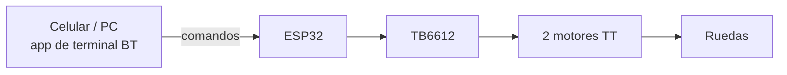

# Proyecto 1 · Carro a control remoto por Bluetooth

> **Peso en la calificación:** 25 % del curso · **Kickoff:** Sesión 7 · **Revisión de avance:** Sesión 9 · **Entrega + Torneo:** Sesión 10
>
> El desarrollo se realiza **fuera de clase**; las sesiones 7, 9 y 10 son de arranque, revisión y entrega.

---

## 1. El reto

Construir en equipo un **carro controlado por Bluetooth** desde un celular o PC, integrando todo lo visto en el curso: electrónica, microcontrolador, actuadores, comunicación y mecanismos. El proyecto cierra con un **torneo de fútbol RC 1v1** entre equipos.

**Equipos:** 3–4 personas (**4 equipos por grupo**). En la propuesta asignen un **responsable** por frente: mecánica/chasis, electrónica/alimentación, firmware, y documentación/portafolio. Responsable no significa exclusivo: en la defensa oral, **cualquier integrante debe poder explicar cualquier parte**.

Este carro **no se desecha**: es la plataforma del Proyecto Final, donde le quitaremos el control humano y lo haremos autónomo con visión por computadora. Diseñen pensando en esa segunda vida.

---

## 2. Requisitos

### 2.1 Funcionales (obligatorios)

| # | Requisito |
| --- | --- |
| R1 | El carro se mueve **adelante, atrás, izquierda, derecha y alto** por comandos Bluetooth. |
| R2 | Control de **velocidad** por PWM (mínimo 3 niveles o velocidad proporcional). |
| R3 | El protocolo de comandos está **documentado** en el portafolio (qué comando hace qué). |
| R4 | **Failsafe**: si se pierde el enlace o no llegan comandos en ≤1 s, el carro se detiene solo. |
| R5 | **Interruptor físico** de encendido/apagado accesible sin desarmar nada. |
| R6 | Alimentación de motores **separada** del ESP32 (con GND común), como se vio en el tema de Actuadores. |
| R7 | Cableado ordenado y sujeto: nada de cables sueltos arrastrando. |
| R8 | **Superficie plana horizontal de al menos 6 × 6 cm en la parte superior**, despejada: ahí vivirá el marcador ArUco del Proyecto Final. |

### 2.2 Restricciones

- **Hardware base:** ESP32 DevKit V1 (clásico, no S3/C3), driver **TB6612**, 2 motores TT con caja reductora.
- **Dimensiones máximas:** 20 × 20 cm de huella (debe caber y maniobrar en la cancha).
- **Chasis:** diseñado y fabricado por el equipo, en coordinación con **Proyectos 1** (corte láser / impresión 3D). Cartón rígido es aceptable como plan B, pero se evalúa la calidad de integración.
- **Baterías:** pilas AA, 18650 con portapilas o LiPo. Si usan LiPo: **nunca** cargarla sin supervisión, nunca perforarla, y traerla siempre en bolsa de seguridad.
- **Presupuesto documentado:** el BOM debe listar cada componente con costo aproximado y si fue comprado, prestado o reutilizado.

### 2.3 Sugerencias (no obligatorias, suman en "integración")

- Sensor a bordo con propósito (ej. MPU6050 detectando choques o volcadura, del tema de Sensores).
- Interfaz de control mejorada (app con botones en vez de terminal de texto).
- Luces, defensa/empujador frontal para la pelota (¡dentro de la huella máxima!).

---

## 3. Hitos y entregables

### Sesión 7 — Kickoff (en clase)

- **Propuesta (1–2 páginas):** objetivo, requisitos propios además de los obligatorios, arquitectura (diagrama en bloques), plan por semanas y criterios de éxito.
- **Boceto del chasis** (CAD o croquis a mano) y **BOM preliminar** con costos.
- **Análisis de riesgos:** qué puede salir mal y su plan B (ej. "si no llega la pieza impresa → cartón").

### Sesión 9 — Revisión de avance (en clase)

- **Demo de subsistemas**: motores girando por comando BT (aunque el chasis no esté terminado).
- **Bitácora de fallas** al día en el portafolio: qué tronó, cómo lo encontraron, cómo lo resolvieron.
- **Defensa oral breve** (3–5 min por equipo) sobre su propio portafolio: cualquier integrante debe poder explicar cualquier parte.

### Sesión 10 — Entrega + Torneo (en clase)

- **Carro funcional** cumpliendo R1–R8, demostrado con rúbrica antes del torneo.
- **Repositorio publicado**: código comentado, esquemático de conexiones, protocolo de comandos, README de uso.
- **Video de demostración** (≤2 min) en el portafolio.
- **Reporte corto (2–3 páginas):** requisitos vs. resultados, mediciones (velocidad máxima real vs. la teórica del ejercicio de Mecanismos), lecciones aprendidas.
- **Participación en el torneo.**

---

## 4. El torneo · Fútbol RC 1v1

El adelanto del VSSS del Proyecto Final, pero con ustedes al control.

**Cancha y pelota**

- Cancha de **1.5 × 1.2 m** con bordes (la misma que usaremos en el Proyecto Final), porterías de **30 cm** marcadas en los lados cortos.
- Pelota: **pelota de golf** (la estándar de VSSS) o pelota plástica ligera de tamaño similar, según disponibilidad.

**Formato**

- Partidos **1v1**, dos tiempos de **2 minutos** con cambio de cancha.
- **Round robin**: con 4 equipos por grupo, todos contra todos (6 partidos) y **final** entre los dos primeros de la tabla. Puntos: victoria 3, empate 1.
- Las posiciones finales de este torneo **siembran la llave del torneo VSSS inter-grupos** del Proyecto Final.
- **Gol:** la pelota cruza completamente la línea de la portería.
- **Empate en eliminación:** muerte súbita de 1 minuto; si persiste, gana quien haya recibido menos faltas.

**Reglas de juego**

- Control exclusivamente por **Bluetooth desde su celular/PC** (nada de empujar con la mano).
- **Falta:** contacto deliberado y repetido carro-contra-carro lejos de la pelota, o sujetar/atrapar al rival contra la pared por más de 5 s. Dos faltas = tiro libre para el rival (pelota al centro, el infractor arranca desde su portería).
- **Carro volcado o desconectado:** el equipo puede acomodarlo con la mano **una vez por tiempo**; a partir de la segunda, se juega sin él hasta el siguiente gol.
- El árbitro (docente) tiene la última palabra.

!!! info "El torneo no se califica por ganar"
    La rúbrica evalúa **participar con un carro funcional y robusto**: completar los partidos sin morir es lo que da puntos. Ganar el torneo da un reconocimiento (y derecho a presumir), no décimas. Así que arriesguen, diviértanse y prueben cosas.

---

## 5. Rúbrica de evaluación (100 pts → 25 % del curso)

| Criterio | Pts | Qué se evalúa |
| --- | --- | --- |
| **Funcionamiento** | 30 | R1–R4: movimiento completo, velocidad variable, protocolo funcionando, failsafe demostrado (se prueba apagando el Bluetooth del control en vivo). |
| **Integración y seguridad** | 20 | R5–R8: chasis, cableado ordenado, alimentación correcta, interruptor, superficie para marcador. Calidad mecánica del ensamble. |
| **Documentación y proceso** | 20 | Repositorio completo, bitácora con evidencia fechada, commits distribuidos en el tiempo (no un mega-commit la noche anterior), BOM con costos, reporte con mediciones reales. |
| **Defensa oral** | 15 | Sesiones 9 y 10: cualquier integrante explica cualquier parte del sistema y del portafolio. No poder explicar el propio trabajo invalida la evidencia correspondiente. |
| **Torneo** | 15 | Presentarse con carro funcional (7), completar los partidos operando de forma segura y sin intervención manual excesiva (8). |

**Penalizaciones:** entrega tardía según política del syllabus (máx. 8.0 hasta 7 días). Incumplir un requisito obligatorio (R1–R8) descuenta directamente en su criterio y debe justificarse en el reporte.

**Uso de IA:** aplica la política del curso — permitida como herramienta declarando dónde se usó; las evidencias (fotos, videos, mediciones, commits) deben ser propias; todo debe poder defenderse oralmente.

---

## 6. Consejos de veteranos

- **Prueben el failsafe temprano.** Es un requisito que se deja al final "porque es fácil" y luego truena en el torneo.
- **El enemigo #1 es la alimentación:** motores que resetean al ESP32 = falta el GND común o la batería no aguanta el pico de arranque. Capacitor de 220 µF cerca del driver ayuda.
- **Pesen la defensa delantera:** un empujador plano mueve mejor la pelota que la carrocería redonda.
- **Guarden todo lo que midan.** La velocidad real vs. teórica, el consumo, los tiempos de respuesta — todo eso es reporte, portafolio y ventaja para sintonizar el PID en el Proyecto Final.
