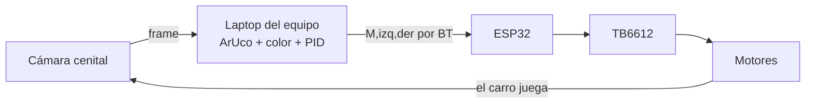

# Proyecto Final · Fútbol de robots (VSSS simplificado)

> **Peso en la calificación:** 25 % del curso · **Kickoff:** Sesión 15 · **Revisión de avance:** Sesión 16 · **Entrega + Torneo:** Sesión 17
>
> El desarrollo se realiza **fuera de clase**; las sesiones 15, 16 y 17 son de arranque, revisión y entrega.

---

## 1. El reto

En el Proyecto 1 ustedes manejaban. Ahora **nadie maneja**: el carro juega solo.

Una cámara cenital ve la cancha, su software en la laptop detecta el carro (por su marcador ArUco) y la pelota (por color), calcula qué hacer y manda las velocidades por Bluetooth. Es la arquitectura de la categoría **IEEE Very Small Size Soccer (VSSS)** de la LARC — la competencia latinoamericana real — en versión simplificada: 1v1, con el carro que ya construyeron.

**Equipos:** los mismos del Proyecto 1, con **el mismo carro** (para eso fue el requisito R8: la superficie del marcador). Si su carro necesita cirugía, háganla — eso también es ingeniería.

---

## 2. Niveles de logro

No todos los equipos llegarán igual de lejos, y está previsto. El proyecto se evalúa por **niveles acumulativos** — cada nivel incluye los anteriores:

| Nivel | El carro logra… | Corresponde a |
| --- | --- | --- |
| **N1 · Navegar** | Llegar solo a un marcador objetivo (ID 0) y detenerse. | Entregable del Tema 6 |
| **N2 · Cazar** | Llegar solo a la **pelota** (detectada por color, sin marcador). | Tema 4 + Tema 6 |
| **N3 · Anotar** | Empujar la pelota y meter gol en **portería vacía** en ≤60 s (desde posición inicial estándar). | Punto de aproximación |
| **N4 · Competir** | Jugar 1v1 contra otro carro autónomo en el torneo. | El VSSS completo |

**N1 es el mínimo** para la revisión de la sesión 16. **N2 es el boleto al torneo**: quien no llegue a N2 hace una demostración cronometrada de su nivel máximo el día de la entrega — sigue habiendo evaluación digna, solo no compite.

---

## 3. Requisitos

### 3.1 Funcionales

| # | Requisito |
| --- | --- |
| R1 | El sistema detecta el **marcador ArUco del equipo** (posición y orientación) en video en vivo. |
| R2 | El carro navega **de forma autónoma** a un objetivo y se detiene (N1). |
| R3 | El sistema detecta la **pelota por color** (segmentación HSV del Tema 4; la pelota no lleva marcador). |
| R4 | **Cero intervención humana** en modo autónomo: manos fuera del teclado durante el juego, salvo los rescates permitidos por reglamento. |
| R5 | El **failsafe** del Proyecto 1 sigue activo: sin comandos en ≤1 s → alto total. Se prueba en vivo cerrando el script. |
| R6 | **Paro desde la PC**: una tecla detiene el carro de inmediato (además del failsafe). |
| R7 | El **marcador** va montado plano y horizontal sobre el carro: ≥5 cm por lado, con su borde blanco, borde superior del patrón apuntando al frente. |
| R8 | Parámetros documentados: ganancias PID finales, rangos HSV de la pelota, FPS y latencia medidos. |

### 3.2 Marcadores asignados

| Equipo | ID ArUco |
| --- | --- |
| Grupo A — Equipos 1 a 4 | **1, 2, 3, 4** |
| Grupo B — Equipos 5 a 8 | **5, 6, 7, 8** |
| Objetivo de pruebas (todos) | **0** |

Diccionario: `DICT_4X4_50`. Genera los tuyos con el script del Tema 6. En cancha compartida, tu software debe **ignorar los IDs ajenos** (el rival estará ahí — filtra por tu ID).

### 3.3 Restricciones

- Mismo hardware base del Proyecto 1 (ESP32 clásico, TB6612, huella ≤ 20 × 20 cm). Se permiten mejoras mecánicas (empujador, ruedas) dentro de la huella.
- **Pelota:** pelota de golf naranja (estándar VSSS) — o la que se defina en el kickoff según disponibilidad; el color se anuncia con tiempo para calibrar.
- **Cámara:** la estructura sobre la cancha admite **una cámara por equipo** (webcam o celular-como-webcam), cada una conectada a la laptop de su equipo. Para desarrollar en casa: cualquier cámara sobre cualquier "cancha" improvisada sirve — los píxeles no saben de canchas oficiales.
- **Software:** todo corre en la laptop del equipo. Librerías libres (OpenCV, NumPy, pySerial). El código es suyo y deben poder explicarlo línea por línea.

---

## 4. Hitos y entregables

### Sesión 15 — Kickoff (en clase)

- **Propuesta (1–2 páginas):** nivel objetivo (sean honestos y ambiciosos), plan de pruebas por **sprints semanales** con criterio de éxito medible por sprint ("sprint 1: N1 en cancha de casa"), y riesgos con plan B.
- **Checklist de cirugía del carro:** qué hay que reparar/mejorar del Proyecto 1.

### Sesión 16 — Revisión de avance (en clase)

- **Demo mínima N1**: el carro llega a un marcador objetivo y se detiene, en vivo.
- **Bitácora al día**: juegos de ganancias probados, mediciones de FPS/latencia, fallas y soluciones.
- **Defensa oral breve** (3–5 min): cualquier integrante explica cualquier parte — incluyendo el código de visión.
- Esta sesión es también el **colchón**: tiempo en clase para destrabar con ayuda del docente.

### Sesión 17 — Entrega + Torneo (en clase)

- **Demostración con rúbrica** del nivel alcanzado (N3 se cronometra; N1–N2 igual, con sus criterios).
- **Torneo VSSS inter-grupos** (equipos con N2+).
- **Repositorio final**: código comentado (firmware + visión), parámetros (R8), README de operación.
- **Portafolio publicado** en su versión final, con el video del proyecto.
- **Reflexión individual (1 página):** qué construiste, qué aprendiste de ti, impacto social de esta tecnología, y tu siguiente paso (¿semillero LARC?).

---

## 5. El torneo · VSSS inter-grupos

**Llave:** eliminación directa de 8, **sembrada con las posiciones del torneo del Proyecto 1**: 1°A vs 4°B, 2°A vs 3°B, 3°A vs 2°B, 4°A vs 1°B. Si algún equipo no alcanza N2, su rival avanza y el equipo hace su demo de nivel en el espacio del partido.

**Partidos**

- 1v1 autónomo, dos tiempos de **2 minutos** con cambio de cancha.
- Arranque: cada carro en su media cancha, pelota al centro, y a la cuenta del árbitro cada equipo presiona **una sola tecla** para soltar a su robot. De ahí en adelante, **manos fuera**.
- **Gol:** la pelota cruza completamente la línea de portería. Tras gol, se reinicia al centro.

**Reglas de autonomía y rescates**

- **Rescate:** si un carro queda volcado, atorado o su software murió, el equipo pide rescate al árbitro; puede acomodarlo con la mano en su media cancha y relanzar su script. Máximo **2 rescates por tiempo**; el reloj no se detiene.
- **Pelota muerta:** si la pelota queda atorada en esquina o pared por más de 10 s sin que nadie la mueva, el árbitro la recoloca al centro.
- **Ambos inertes:** si ningún carro toca la pelota en 30 s, se reinicia la jugada al centro.
- **Empate en la llave:** muerte súbita de 1 minuto; si persiste, gana quien haya usado menos rescates; si persiste, tanda de "penales": gol a portería vacía cronometrado, gana el más rápido.
- El árbitro (docente) tiene la última palabra.

!!! info "Igual que en el Proyecto 1: ganar da gloria, no décimas"
    La rúbrica premia presentarse con un sistema funcional del mayor nivel posible y operarlo con limpieza. El campeón inter-grupos se lleva el reconocimiento — y el primer lugar en la lista del semillero para armar un equipo **LARC VSSS real** de la universidad, si le interesa.

---

## 6. Rúbrica de evaluación (100 pts → 25 % del curso)

| Criterio | Pts | Qué se evalúa |
| --- | --- | --- |
| **Funcionamiento por nivel** | 35 | N1 = 15 · N2 = 25 · N3 = 30 · N4 = 35. Se otorgan los puntos del nivel **demostrado en vivo** el día de la entrega (acumulativo). |
| **Robustez e integración** | 15 | R4–R7: autonomía real, failsafe y paro probados, marcador bien montado, sistema que sobrevive a la sesión completa sin cirugía de emergencia. |
| **Documentación y proceso** | 20 | Bitácora con juegos de ganancias y mediciones (R8), commits distribuidos en el tiempo, repositorio completo, portafolio final publicado. |
| **Defensa oral** | 15 | Sesiones 16 y 17: cualquier integrante explica cualquier parte (visión, control, firmware). No poder explicar el propio trabajo invalida la evidencia correspondiente. |
| **Torneo / demo final** | 15 | Presentarse listos y a tiempo (7); operar con limpieza el partido o la demo de nivel: arranque de una tecla, rescates dentro de regla, actitud deportiva (8). |

**Penalizaciones:** entrega tardía según política del syllabus (máx. 8.0 hasta 7 días). La **reflexión individual** es personal: no entregarla descuenta 10 pts *a ese integrante*, no al equipo.

**Uso de IA:** aplica la política del curso — permitida como herramienta declarando dónde se usó; evidencias propias; todo defendible oralmente. En este proyecto la defensa incluye el código de visión: "lo generó una IA y no sé qué hace" invalida el criterio de defensa.

---

## 7. Consejos de veteranos

- **Sintonicen el giro primero, con el avance en cero** (Tema 6). El 80 % de los carros que "bailan" alrededor de la pelota tienen el Kp de giro alto y nunca lo aislaron.
- **Midan la latencia antes de culpar al PID.** Si el lazo completo tarda 200 ms, ningún juego de ganancias los salvará de oscilar; bajen resolución y suban luz.
- **La luz del día del torneo no es la de su casa.** Lleguen temprano a recalibrar los rangos HSV de la pelota — el ArUco aguanta, el color no.
- **El punto de aproximación es la diferencia entre N2 y N3**: llegar a la pelota por el lado equivocado la mete en su propia portería. Relean el reto 3 del Tema 6; es cambiar qué punto le pasan al PID.
- **Guarden una versión que funciona.** Antes de "mejorar" el código la noche anterior, hagan commit y tag de la versión estable. El torneo se juega con la versión que sirve, no con la que casi sirve.
